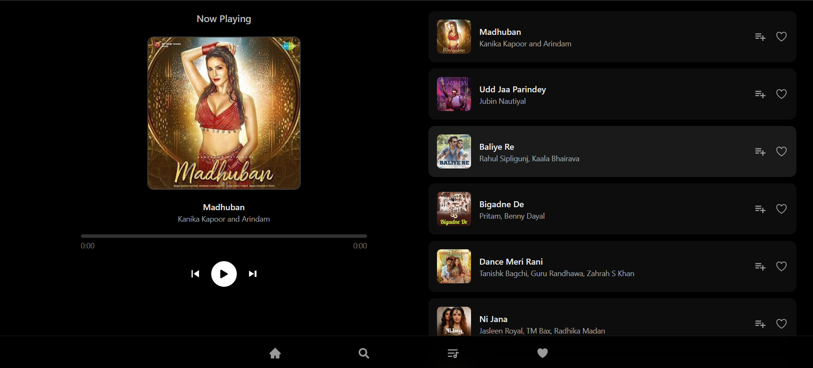
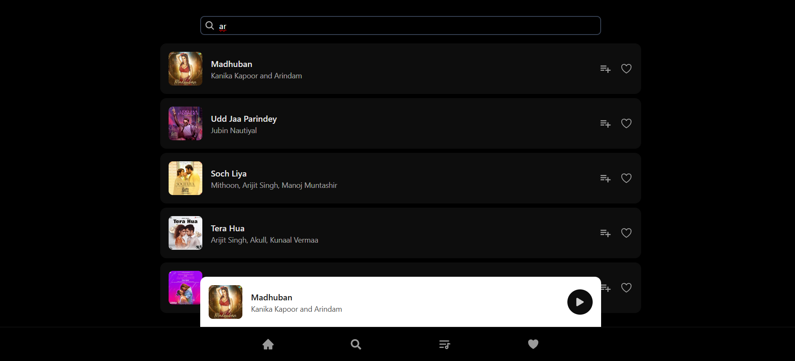
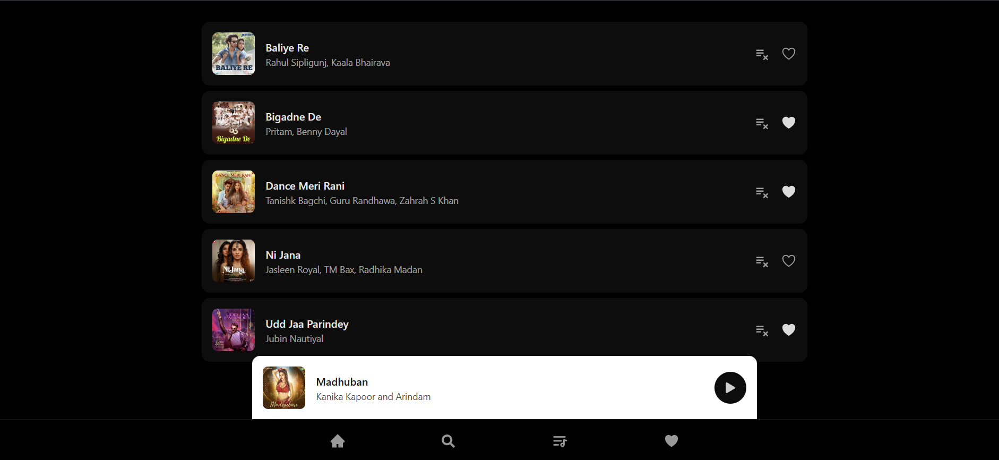
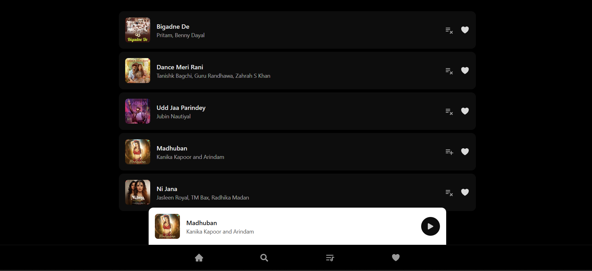

# Music App

A modern React-based music player application built with Vite, featuring dynamic playlist management, audio playback controls, and seamless state handling using React Context API.

[Live Demo on Vercel](https://music-app-cyan.vercel.app/like)  
[GitHub Repository](https://github.com/TheGitaPrince/Music-App)

---

## Features

- Play, pause, and toggle audio playback  
- Skip to next or previous songs in a looping playlist  
- Dynamic playlist loaded from `songs.js`  
- Automatic advancement to the next track when current ends  
- Global audio state management with React Context, `useState`, `useRef`, and `useEffect`  
- Responsive UI with playlist and search functionality

---

## Screenshot

---

---

## Key Dependencies

| Package           | Purpose                          |
|-------------------|---------------------------------|
| react             | UI Library                      |
| vite              | Build tool & development server |
| tailwindcss       | CSS framework                    |
| @reduxjs/toolkit  | State management                 |
| react-router-dom  | Routing                         |
| react-icons       | Icons                          |

---

---

## Usage

The core application logic and state management are handled in `UserContext.js`. This includes:

- Managing audio element and playback state with `useRef` and `useState`
- Updating audio source dynamically on song change
- Controls to play, pause, toggle, skip next and previous songs
- Automatic advance to next song on completion

---